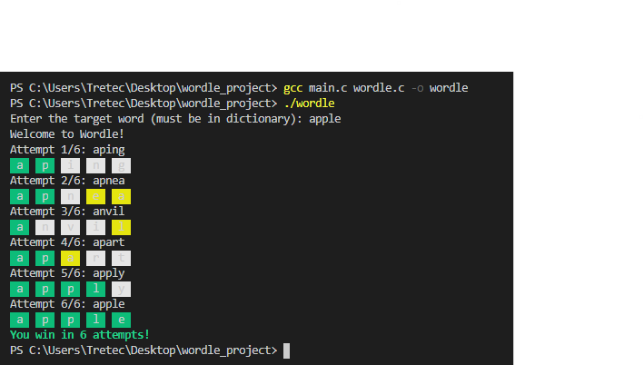
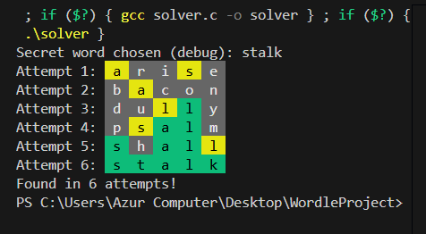

# Wordle Project 🎮
## First Part
## Introduction
This project is a simplified implementation of the popular Wordle game, written in C.  
It allows the player to choose a target word from a dictionary file and then try to guess it within 6 attempts.  
Feedback is displayed using colored boxes:
- 🟩 Green = correct letter in the correct position
- 🟨 Yellow = correct letter in the word but wrong position
- ⬜ Gray = letter not in the word

The goal is to provide a fun way to practice programming concepts such as file handling, loops, user input validation, and colored terminal output.

---

## Objectives
- Implement a Wordle‑style game in C.  
- Practice modular programming with multiple source files (`main.c`, `wordle.c`, `wordle.h`).  
- Use ANSI escape codes to display colored feedback in the terminal.  
- Validate user input against a dictionary file.  
- Provide clear win/lose messages after 6 attempts.

---

## Project Structure
- **main.c** → Handles game flow, user input, and attempts.  
- **wordle.c** → Contains functions for dictionary loading, input validation, and feedback display.  
- **wordle.h** → Header file with constants and function prototypes.  
- **words.txt** → Dictionary file containing valid 5‑letter words.  

---

## How to Compile & Run
Open a terminal in the project folder and type:

```bash
gcc main.c wordle.c -o wordle
./wordle
```
## Example Execution 📸
Here’s a screenshot of the game in action:




## Features
- User chooses the target word at the start.  
- 6 attempts maximum.  
- Colored feedback boxes for each guess.  
- Invalid guesses do not consume attempts.  
- Clear win/lose messages.  


## Conclusion
This project demonstrates how a simple game can be built in C using modular design and terminal formatting.  
It combines logic, user interaction, and visual feedback to create an engaging experience.  
Overall, it highlights the importance of clean code structure, user‑friendly output, and creativity in programming assignments.


# Wordle Solver in C (Colored Output)
## Second Part
# 🎯 Wordle Solver in C

An automated Wordle solver with colored feedback display, developed in C.

## 📝 Project Description

This program implements an automatic Wordle game solving algorithm. It guesses a 5-letter secret word in a maximum of 6 attempts using:

- **Intelligent filtering algorithm**: eliminates impossible candidates after each attempt
- **Colored visual feedback**: 
  - 🟩 Green background = correct letter in correct position
  - 🟨 Orange background = letter exists but wrong position
  - ⬜ Gray background = letter not in the word
- **Word dictionary**: loads possible words from `words.txt`
- **Random selection**: chooses a random secret word for each execution

### Solving Algorithm

1. Starts with the initial word `"arise"`
2. Displays colored feedback for each attempt
3. Filters candidates based on received clues
4. Selects the next candidate word
5. Repeats until finding the word or reaching 6 attempts

## 🚀 Compilation and Execution

### Prerequisites
- GCC compiler
- Unix/Linux system (for ANSI color codes)
- `words.txt` file in the same directory

### Compilation
```bash
gcc -o solver solver.c
```

### Execution
```bash
./solver
```

## 📂 Project Structure

```
WORDLEPROJECT/
├── solver.c                  # Main source code
├── words.txt                 # Word dictionary (5 letters)
├── README.md                 # Project documentation
└── image.wordlesolver.png    # Execution screenshot
```

## 💡 Execution Example

The program displays the secret word (for debugging) then attempts to guess it:

```
Secret word chosen (debug): apple
Attempt 1:  a   r   i   s   e 
           🟩  ⬜  ⬜  ⬜  🟨
Attempt 2:  a   p   p   l   e 
           🟩  🟩  🟩  🟩  🟩
Found in 2 attempts!
```

### Screenshot



## 🔧 Main Features

- **`load_dictionary()`**: Loads words from `words.txt`
- **`print_colored_feedback()`**: Displays feedback with colored ANSI codes
- **`filter_candidates()`**: Eliminates impossible words based on feedback
- **`select_next_guess()`**: Chooses the next word to try
- **`solver()`**: Main solving loop

## 📊 Configurable Parameters

| Constant | Value | Description |
|----------|-------|-------------|
| `MAX_WORDS` | 10000 | Maximum dictionary size |
| `WORD_LEN` | 5 | Word length |
| Max attempts | 6 | Maximum number of tries |

## 🎨 ANSI Color Codes Used

```c
#define GREEN   "\x1b[42m\x1b[30m"   // Green background, black text
#define ORANGE  "\x1b[43m\x1b[30m"   // Yellow/orange background, black text
#define GRAY    "\x1b[100m\x1b[30m"  // Dark gray background, black text
#define RESET   "\x1b[0m"            // Reset
```

## 🐛 Error Handling

- Verification of `words.txt` file opening
- Explicit error messages in case of problems
- Buffer overflow protection


